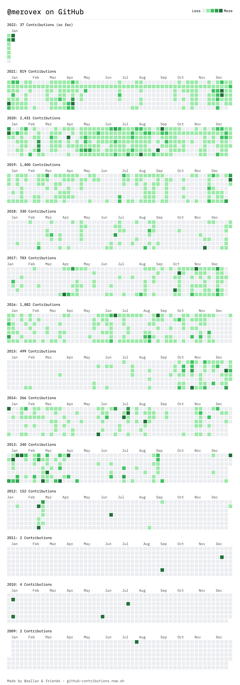

# Ben Wilson

## About Ben

Ben Wilson is the author of the Postal Marines science fantasy series. He’s into history, human nature and religious studies. He served in the US Army through his 20s and got to meet some great people there. Now he does routine IT project management for customers who should know better. He pays the bills through their frustration. Ben lives in Northern Virginia with his wife, three of his four children, and two rabid attack cats. No, I did not sell the oldest off to the Core, as much as I might have liked to. He has a family of his own.
[Learn more](https://benwilsonwrites.com/)

## Writing Projects

* [Postal Marine Series](https://github.com/Merovex/postal-marines-series)
   * Write about 100 years from now, when Musk wins.
   * _Bellicose_ 
   * _Luctation_ 
   * _Imbroglio_ 
   * _Scintilla_ 
   * _Solace_
* [Tears in the Rain](https://github.com/Merovex/tears) 
* Trolls in Space 
* [Strand Series](https://github.com/Merovex/stranded-series)
   * _Book 1 - Discovery_: 
* Pigna Balkni 
* King David 

## Seinfeld Productivity - Don't Break the Chain

Big one-year wall calendar. Place a Red-X when you complete your objective. Don't break the chain.

Need to add something like GH calendar here.

<!--
**Merovex/Merovex** is a ✨ _special_ ✨ repository because its `README.md` (this file) appears on your GitHub profile.

Here are some ideas to get you started:

- 🔭 I’m currently working on ...
- 🌱 I’m currently learning ...
- 👯 I’m looking to collaborate on ...
- 🤔 I’m looking for help with ...
- 💬 Ask me about ...
- 📫 How to reach me: ...
- 😄 Pronouns: ...
- ⚡ Fun fact: ...
-->
